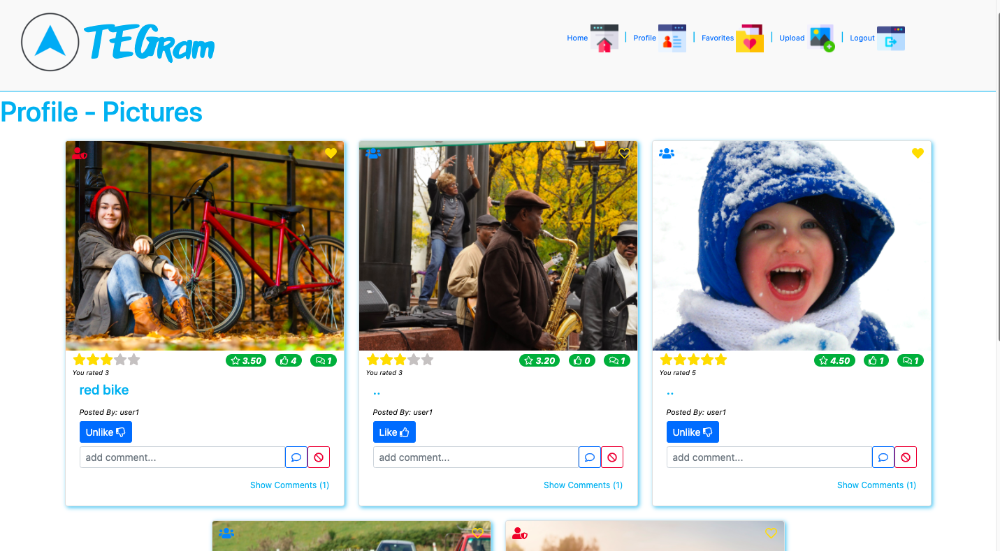

# TEGram Photo Sharing App
Photo sharing app, developed utilizing Java, PostgreSQL, JDBC, Spring Boot, JSON, RESTful API on back-end and Vue.js, JavaScript, HTML, CSS, Bootstrap on front-end.
Image host cloud: cloudinary.com

[Deployed link](https://image-client.herokuapp.com/)

Sample images from https://cloudinary.com/ . Image rights: [Cloudinary.com/](https://cloudinary.com/) 

# Final Client Page Look

